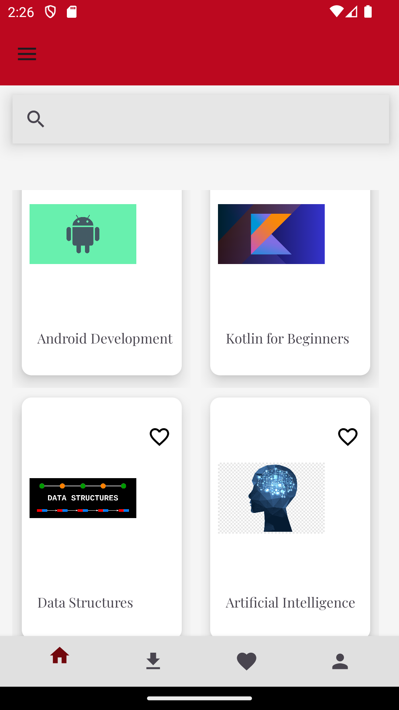

# LearnConnectApp

## Project Overview
LearnConnect is a modern video-based education platform that allows users to enroll in courses and watch lesson videos.

## Technologies Used
- **Platform:** Android
- **Language:** Kotlin
- **Architecture:** MVVM
- **Database:** SQLite, Room
- **Authentication:** Firebase Authentication
- **Unit Testing:** Tests for login and logout functionalities.

## Installation Steps
1. **Download Project Files:**
   Download the project files from the GitHub repository.
   
2. **Open Android Studio:**
   Launch Android Studio and open the project.

3. **Install Required Dependencies:**
   Ensure that the libraries used in the project are installed. Check the dependencies in the `build.gradle` file.

4. **Create a Firebase Project:**
   Create a new project in Firebase Console and configure authentication settings.

5. **Run the Application:**
   Run the application on an emulator or a real device.

## Features
- **User Operations:**
  - User registration (with email and password)
  - User login
  - User profile viewing

- **Course Management:**
  - Course listing
  - Users can enroll in courses

- **Video Player:**
  - Users can watch lesson videos for enrolled courses
  - Video progress is saved locally

- **Dark Mode Support:**
  - Users can enable dark mode for the application

## Testing
Unit tests have been written for login and logout operations. These tests ensure the reliability of user authentication processes.

## Bonus Features
- **Searching Courses:** Courses can be searched by keywords.
- **Favorites (Watchlist):** Users can add courses to their favorites.
- **Commenting and Rating System:** Users can leave comments and rate courses.

## 📸 Screenshots

|           |          |            |
|:----------------------------------------------------------------------:|:----------------------------------------------------------------------:|:----------------------------------------------------------------------:|
|                            **WELCOME PAGE**                            |                           **REGISTER PAGE**                            |                             **LOGIN PAGE**                             |

|      |           |       |
|:----------------------------------------------------------------------:|:----------------------------------------------------------------------:|:----------------------------------------------------------------------:|
|                        **HOMEPAGE**                                 |                             **NAVIGATION DRAWER**                              |                           **COURSE DETAIL PAGE**                      |

|           |            |           |                                                                           
|:----------------------------------------------------------------------:|:----------------------------------------------------------------------:|:-------------------------------------------------------------------------:|
|                    **ADDING COMMENT AND RATING**                         |                           **FAVOURITES PAGE**                           |                         **PROFILE PAGE**                                |                                                                            
                                                                                                                         
         

  

This README file provides an overview of the LearnConnect application’s functionalities and installation steps.                    
If you have any questions or feedback, please feel free to reach out to me. -> isikk428@gmail.com. :)
Thank you so much!
